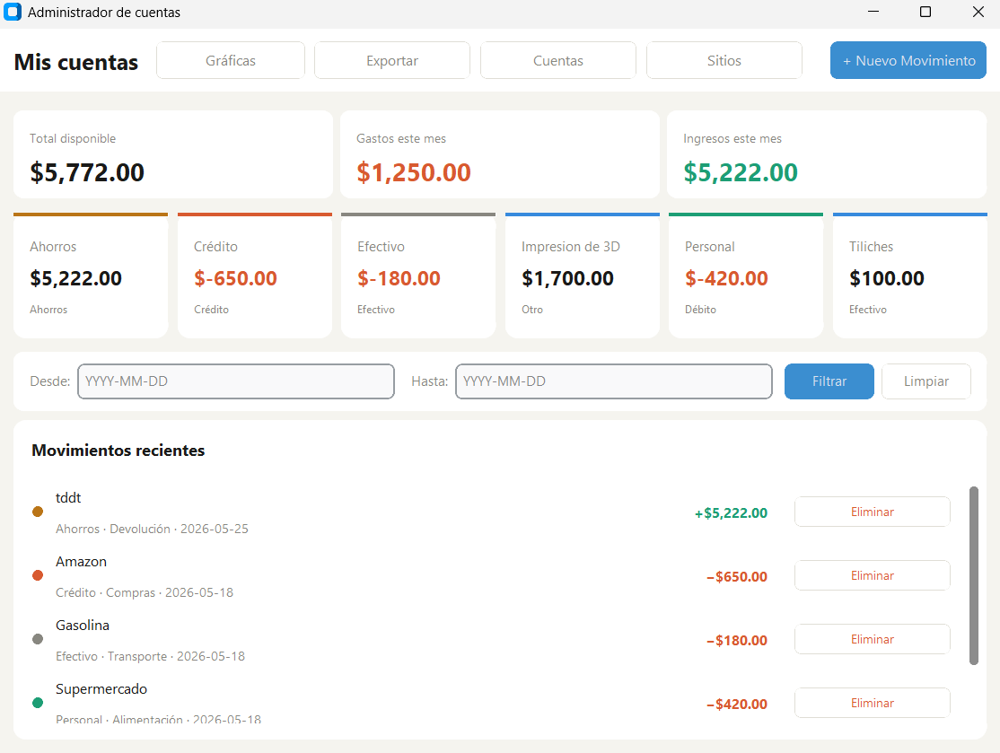
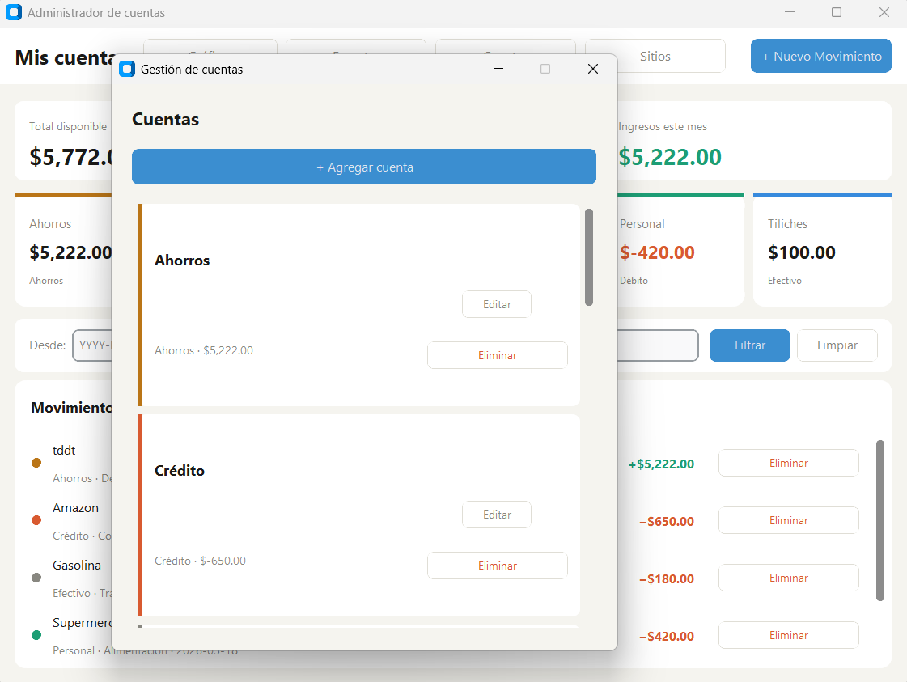
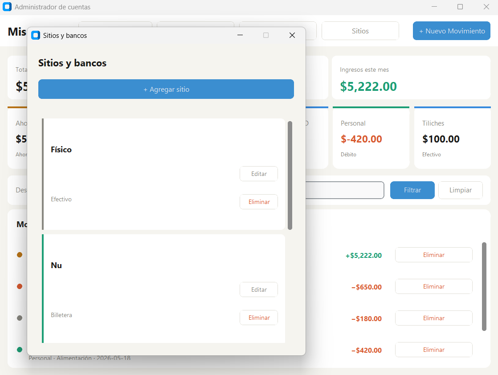
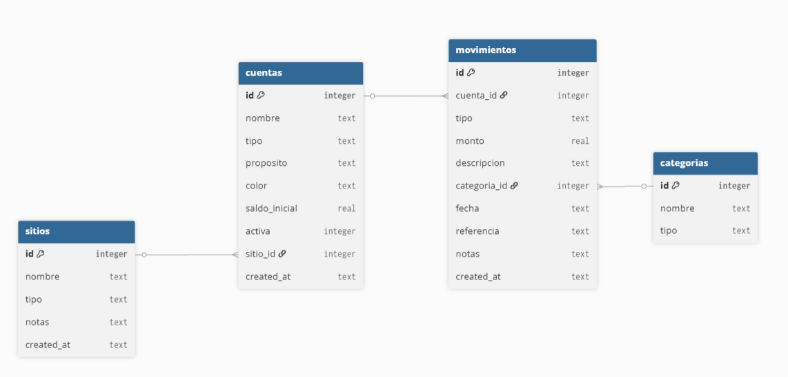

# 💰 Gestor de Cuentas Personales

App de escritorio desarrollada en Python para registrar, visualizar y analizar ingresos y gastos por cuenta bancaria o efectivo.

Desarrollado por **Paulina Cazares**

---

## 📸 Descripción

Proyecto personal creado para llevar el control de múltiples cuentas bancarias, tarjetas y dinero en efectivo desde un solo lugar. Permite registrar movimientos, filtrar por cuenta o fecha, visualizar gráficas de gastos y exportar el historial a Excel.

---

## ✨ Funcionalidades

- **Cuentas** — agrega, edita y archiva cuentas (débito, crédito, ahorros, efectivo)
- **Sitios / Bancos** — organiza tus cuentas por banco o billetera digital (Nu, Santander, etc.)
- **Movimientos** — registra ingresos y gastos con categoría, fecha y notas
- **Filtros** — filtra movimientos por cuenta o por rango de fechas
- **Resumen** — visualiza saldo disponible, gastos e ingresos del mes en tiempo real
- **Gráficas** — análisis visual de ingresos y gastos por cuenta y tendencia por mes
- **Exportar a Excel** — genera un archivo `.xlsx` con resumen, historial y totales por cuenta

---

## 🛠️ Tecnologías utilizadas

| Tecnología    | Uso                              |
| ------------- | -------------------------------- |
| Python 3.13   | Lenguaje principal               |
| SQLite        | Base de datos local              |
| CustomTkinter | Interfaz gráfica de escritorio   |
| Matplotlib    | Gráficas y visualización         |
| OpenPyXL      | Exportación a Excel              |
| PyInstaller   | Generación del ejecutable `.exe` |

---

## 📁 Estructura del proyecto

```
gestion-cuentas/
├── pantallaPrincipal.py      # Ventana principal
├── formularioMovimiento.py   # Formulario de ingresos y gastos
├── gestionCuentas.py         # Gestión de cuentas
├── gestionSitios.py          # Gestión de sitios / bancos
├── graficas.py               # Ventana de gráficas
├── exportar.py               # Exportación a Excel
├── database.py               # Base de datos SQLite y funciones CRUD
├── config.py                 # Constantes globales (colores, fuente)
└── README.md
```

---

## 🚀 Instalación y uso

### Requisitos

- Python 3.8 o superior

### 1. Clona el repositorio

```bash
git clone https://github.com/ALoca19/gestion-cuentas.git
cd gestion-cuentas
```

### 2. Instala las dependencias

```bash
pip install customtkinter matplotlib openpyxl
```

### 3. Ejecuta la app

```bash
python pantallaPrincipal.py
```

La base de datos `wallet.db` se crea automáticamente la primera vez.

---

## 📦 Ejecutable

Si prefieres usar la app sin instalar Python, puedes generar el ejecutable:

```bash
pip install pyinstaller
pyinstaller --onefile --windowed --name "MisCuentas" pantallaPrincipal.py
```

El archivo `.exe` se genera en la carpeta `dist/`.

---

## 📊 Capturas de pantalla







---

## 📊 Estructura de la Base de datos



---

## 🗺️ Roadmap

- [ ] Modo oscuro
- [ ] Recordatorios de pagos
- [ ] Presupuesto mensual por categoría
- [ ] Versión web

---

## 📄 Licencia

Proyecto personal de uso libre.

---

_Desarrollado con Python como proyecto de aprendizaje y uso personal._
